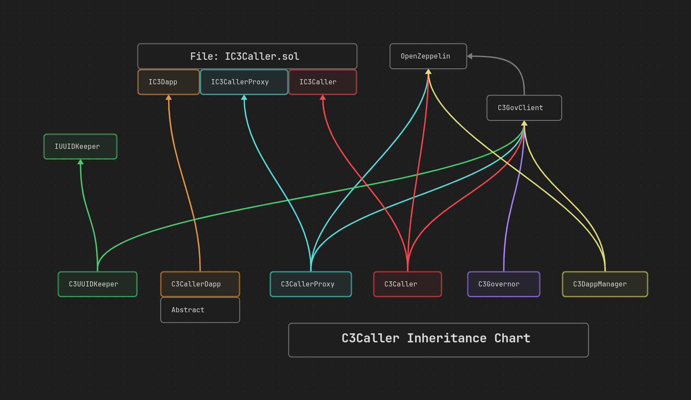

# C3Caller (Continuum Cross-Chain Caller)

:satellite: A smart contract suite for arbitrary execution of data across
cross-chain DApps using the ContinuumDAO MPC network.

# Table of Contents

[Project Structure](#projectstructure)\
[Installation](#installation)\
[Integration](#integration)\
[API Reference](#apireference)

# Project Structure

src/\
├── C3Caller.sol\
├── dapp\
│   ├── C3CallerDapp.sol\
│   └── C3DappManager.sol\
├── gov\
│   ├── C3GovClient.sol\
│   ├── C3GovernDapp.sol\
│   └── C3Governor.sol\
├── upgradeable\
│   ├── C3CallerUpgradeable.sol\
│   ├── dapp\
│   │   ├── C3CallerDappUpgradeable.sol\
│   │   └── C3DappManagerUpgradeable.sol\
│   ├── gov\
│   │   ├── C3GovClientUpgradeable.sol\
│   │   ├── C3GovernDappUpgradeable.sol\
│   │   └── C3GovernorUpgradeable.sol\
│   └── uuid\
│       └── C3UUIDKeeperUpgradeable.sol\
├── utils\
│   ├── C3CallerProxy.sol\
│   └── C3CallerUtils.sol\
└── uuid\
    └── C3UUIDKeeper.sol

# Installation

## Dependencies

[Foundry](https://getfoundry.sh/) is currently supported, or any smart contract
development framework that supports git submodules.

Install C3Caller to access the smart contracts and implement a C3CallerDApp:

```bash
forge install ContinuumDAO/c3caller
```

Example entry in `remappings.txt`:

```
@c3caller/=lib/c3caller/src/
```

# Integration into your DApp

Inherit from `C3CallerDApp` and implement the required functions to make it C3Caller compliant:

```solidity
import { C3CallerDApp } from "@c3caller/dapp/C3CallerDApp.sol";

contract MyDApp is C3CallerDApp {

    error CrossChainTransferFailed();

    // The address of the corresponding contract on another chain that will be in communication with this one.
    // It is a string type to accommodate networks that use some other form of account, other than 20-byte hex.
    mapping (string => string) public peers;

    mapping (address => bool) public isMPC;
    mapping (address => uint256) public failedTransfer;

    // Here, we initialize the DApp. Initialize C3CallerDApp with the c3caller endpoint and your DApp ID.
    constructor (address _endpoint, uint256 _dappID, address _mpc, string[] memory _chainIDs, string[] memory _peers)
        C3CallerDApp(_endpoint, _dappID)
    {
        isMPC[_mpc] = true;

        // Here tell this contract the addresses of the contracts that are deployed on other networks that we wish to
        // communicate with via c3caller.
        for (uint8 i = 0; i < _chainIDs.length; i++) {
            peers[_chainIDs[i]] = _peers[i];
        }
    }

    // Override this function to decide who can execute functions in your DApp (for incoming cross-chain calls)
    // Set it to allow the valid MPC address on the network in question to allow cross-chain execution from other chains
    function isValidSender(address _txSender) external view virtual override returns (bool) {
        return isMPC[_txSender];
    }

    // Override this function to decide what happens when a cross-chain call reverted on the target network.
    // In this example, we check for a known error on the target network and act accordingly.
    function _c3Fallback(bytes4 _selector, bytes calldata _data, bytes calldata _reason)
        internal
        virtual
        override
        returns (bool)
    {
        if (_selector == CrossChainTransferFailed.selector) {
            (address _recipient, uint256 _amount) = abi.decode(_data, (address, uint256));
            // A cross-chain transfer has failed. Compensate the would-be recipient locally
            failedTransfer[_recipient] += _amount;
        }
        return true;
    }

    // Here we have a function that initiates a cross-chain call. It provides the address of the contract on the
    // target network, based on the given chain ID.
    function transferCrossChain(string memory _targetChainID, address _recipient, uint256 _amount) external {
        bytes memory _data = abi.encodeWithSignature("receiveCrossChain(address,uint256)", (_recipient, _amount));
        string memory _targetNetworkDAppAddress = peers[_targetChainID];
        _c3call(_targetNetworkDAppAddress, _chainID, _data);
    }

    // This function can be executed by `transferCrossChain` that was called from another network.
    // Note the `onlyCaller` modifier to ensure only the C3Caller contract (and thus the MPC network) can call this.
    function receiveCrossChain(address _recipient, uint256 _amount) external onlyCaller {
        tokenXYZ.transfer(_recipient, _amount);
    }
}
```

# API Reference

For further reading, see our [documentation](docs/TableOfContents.md);

# C3Caller Deployed Contracts

# Ethereum Sepolia

[C3Caller (proxy)](https://sepolia.etherscan.io/address/0x9e0625366F7d85A174a59b1a5D2e44F1492a9cBB)

[C3Caller (implementation)](https://sepolia.etherscan.io/address/0x7A43576Da6A2f738F724747697Cd2fD2424F0C7D)

[C3UUIDKeeper (proxy)](https://sepolia.etherscan.io/address/0xE605C920c942EA4E807a688c554bf83C59D4DB41)

[C3UUIDKeeper (implementation)](https://sepolia.etherscan.io/address/0x849a78D9e70D2428c9531981f6F3fcEcB378A78f)

# Arbitrum Sepolia

[C3Caller (proxy)](https://sepolia.arbiscan.io/address/0x9e0625366F7d85A174a59b1a5D2e44F1492a9cBB)

[C3Caller (implementation)](https://sepolia.arbiscan.io/address/0x7A43576Da6A2f738F724747697Cd2fD2424F0C7D)

[C3UUIDKeeper (proxy)](https://sepolia.arbiscan.io/address/0xE605C920c942EA4E807a688c554bf83C59D4DB41)

[C3UUIDKeeper (implementation)](https://sepolia.arbiscan.io/address/0x849a78D9e70D2428c9531981f6F3fcEcB378A78f)

# Base Sepolia

[C3Caller (proxy)](https://sepolia.basescan.org/address/0x9e0625366F7d85A174a59b1a5D2e44F1492a9cBB)

[C3Caller (implementation)](https://sepolia.basescan.org/address/0x7A43576Da6A2f738F724747697Cd2fD2424F0C7D)

[C3UUIDKeeper (proxy)](https://sepolia.basescan.org/address/0xE605C920c942EA4E807a688c554bf83C59D4DB41)

[C3UUIDKeeper (implementation)](https://sepolia.basescan.org/address/0x849a78D9e70D2428c9531981f6F3fcEcB378A78f)

# Scroll Sepolia

[C3Caller (proxy)](https://sepolia.scrollscan.com/address/0x9e0625366F7d85A174a59b1a5D2e44F1492a9cBB)

[C3Caller (implementation)](https://sepolia.scrollscan.com/address/0x7A43576Da6A2f738F724747697Cd2fD2424F0C7D)

[C3UUIDKeeper (proxy)](https://sepolia.scrollscan.com/address/0xE605C920c942EA4E807a688c554bf83C59D4DB41)

[C3UUIDKeeper (implementation)](https://sepolia.scrollscan.com/address/0x849a78D9e70D2428c9531981f6F3fcEcB378A78f)

# BSC Testnet

[C3Caller (proxy)](https://testnet.bscscan.com/address/0x9e0625366F7d85A174a59b1a5D2e44F1492a9cBB)

[C3Caller (implementation)](https://testnet.bscscan.com/address/0x7A43576Da6A2f738F724747697Cd2fD2424F0C7D)

[C3UUIDKeeper (proxy)](https://testnet.bscscan.com/address/0xE605C920c942EA4E807a688c554bf83C59D4DB41)

[C3UUIDKeeper (implementation)](https://testnet.bscscan.com/address/0x849a78D9e70D2428c9531981f6F3fcEcB378A78f)

# OP BNB Testnet

[C3Caller (proxy)](https://opbnb-testnet.bscscan.com/address/0x9e0625366F7d85A174a59b1a5D2e44F1492a9cBB)

[C3Caller (implementation)](https://opbnb-testnet.bscscan.com/address/0x7A43576Da6A2f738F724747697Cd2fD2424F0C7D)

[C3UUIDKeeper (proxy)](https://opbnb-testnet.bscscan.com/address/0xE605C920c942EA4E807a688c554bf83C59D4DB41)

[C3UUIDKeeper (implementation)](https://opbnb-testnet.bscscan.com/address/0x849a78D9e70D2428c9531981f6F3fcEcB378A78f)

# Holesky

[C3Caller (proxy)](https://holesky.etherscan.io/address/0x9e0625366F7d85A174a59b1a5D2e44F1492a9cBB)

[C3Caller (implementation)](https://holesky.etherscan.io/address/0x7A43576Da6A2f738F724747697Cd2fD2424F0C7D)

[C3UUIDKeeper (proxy)](https://holesky.etherscan.io/address/0xE605C920c942EA4E807a688c554bf83C59D4DB41)

[C3UUIDKeeper (implementation)](https://holesky.etherscan.io/address/0x849a78D9e70D2428c9531981f6F3fcEcB378A78f)

# Avalanche Fuji

[C3Caller (proxy)](https://testnet.snowscan.xyz/address/0x9e0625366F7d85A174a59b1a5D2e44F1492a9cBB)

[C3Caller (implementation)](https://testnet.snowscan.xyz/address/0x7A43576Da6A2f738F724747697Cd2fD2424F0C7D)

[C3UUIDKeeper (proxy)](https://testnet.snowscan.xyz/address/0xE605C920c942EA4E807a688c554bf83C59D4DB41)

[C3UUIDKeeper (implementation)](https://testnet.snowscan.xyz/address/0x849a78D9e70D2428c9531981f6F3fcEcB378A78f)

# Soneium Minato

[C3Caller (proxy)](https://soneium-minato.blockscout.com/address/0x9e0625366F7d85A174a59b1a5D2e44F1492a9cBB)

[C3Caller (implementation)](https://soneium-minato.blockscout.com/address/0x7A43576Da6A2f738F724747697Cd2fD2424F0C7D)

[C3UUIDKeeper (proxy)](https://soneium-minato.blockscout.com/address/0xE605C920c942EA4E807a688c554bf83C59D4DB41)

[C3UUIDKeeper (implementation)](https://soneium-minato.blockscout.com/address/0x849a78D9e70D2428c9531981f6F3fcEcB378A78f)


# OLD
Inheritance order:
contract MyToken is IMyToken, ERC20Upgradeable, OwnableUpgradeable, Initializable, UUPSUpgradeable


# C3Caller Overview

## Basic C3Caller Solidity Code

### Introduction

This repository contains ContinuumDAO's `c3caller` code, the purpose of which to
have a standalone reference of `c3caller` for replication on non-EVM chains.

> _Notice_
>
> This codebase should not be used as the official reference for C3Caller. Please
see [router-contract](https://github.com/ContinuumDAO/router-contract.git).



The following document is an overview of the interface and a brief description
of each method in C3Caller, for purpose of replication on non-EVM chains, and as
an aid for builders.

> _Note_
>
> In the following text I use _caller_ to refer to the MPC network account that signs transactions on the destination chain.

## C3Caller

### **Notes**

- `c3broadcast`: Why do we require that the length of the passed data is equal
to the length of the chain ID array?

### C3CallerStructLib

```solidity
struct C3EvmMessage {
    bytes32 uuid;
    address to;
    string fromChainID;
    string sourceTx;
    string fallbackTo;
    bytes data;
}
```

This is a struct of a message that is received by the (EVM) destination chain.

### constructor

```solidity
constructor(address _swapIDKeeper)
```

Set the governance as the msg.sender, set the UUID keeper contract as the swap
ID keeper argument.

### c3call

```solidity
function c3call(
	uint256 _dappID,
	address _caller,
	string calldata _to,
	string calldata _toChainID,
	bytes calldata _data,
	bytes memory _extra
) external memory override whenNotPaused;
```

Require: the DApp ID to be non-zero, the to address to be defined, the chain ID
to be defined, the data to be defined.

The arguments listed above, along with a generated UUID, is logged with `LogC3Call`.

### c3broadcast

```solidity
function c3broadcast(
	uint256 _dappID,
	address _caller,
	string[] calldata _to,
	string[] calldata _toChainIDs,
	bytes calldata _data
) external override whenNotPaused;
```

Require: the DApp ID to be non-zero, the to address array length to be non-zero,
the to chain ID array length to be non-zero, the data to be defined, the length
of the data should be equal to the length of the to chain ID array.

For each value of to address and to chain ID, a UUID is taken of the arguments
listed above, with which it is logged with `LogC3Call`.

**This function can be seen as a bundler for `c3call`.**

### execute

```solidity
function execute(
    uint256 _dappID,
    address _txSender,
    C3CallerStructLib.C3EvmMessage calldata _message
) external override onlyOperator whenNotPaused;
```

Require: message data is defined, message DApp ID target is equal to the
specified DApp ID, the message UUID has not been already completed according to
UUID keeper.

1. The storage value `context` is set to the current message context (UUID, from
chain ID, source chain transaction hash).
2. The target address `to` is called with the given data.
3. The storage value `context` is reset to empty context.

> _Note_
>
> (The target address `to` should be a C3CallerDapp implementation. During the
execution of the call, the DApp can query the `context` that is the storage
value for the duration of the execution.)

The message data, success/fail and return data of the execution is logged with
`LogExecCall` (this happens whether the call succeeded or not).

The return data of the execution is passed into toUint, where it does a
low-level check that the return data has length 32, and the low order byte
equals one, which means the function returned true. If this is the case and the
success boolean returned from the call is true, then the UUID is registered as
complete in the UUID keeper.

If the above conditions are not met, the data is logged with `LogFallbackCall`.

### c3Fallback

```solidity
function c3Fallback(
    uint256 _dappID,
    address _txSender,
    C3CallerStructLib.C3EvmMessage calldata _message
) external override onlyOperator whenNotPaused;
```

Require: message data is defined, the message UUID has not been already
completed according to UUID keeper, the sender of the fallback transaction
(_caller_) is valid according to the DApp, DApp ID in target is equal to the
specified DApp ID.

1. The storage value `context` is set to the current message context (UUID,
from chain ID, source chain transaction hash).
2. Perform a `functionCall` (see OZ Address library) on the target address (the
C3CallerDapp implementation), passing the message data and an error message.
3. The storage value `context` is reset to empty context.

The UUID is registered as complete in the UUID keeper, and the message context
and result from the call are logged with `LogExecFallback`.

### toUint

```solidity
function toUint(
    bytes memory bs
) internal pure returns (bool, uint)
```

A low-level check is performed that the data has length 32, and that the lower
order byte is equal to one. This is to ensure that the bytes returned from the
low-level address call is a 32 byte string (which it always is if the return
data is <= 32 bytes) and that the return value was true, or some variation of true.

## C3CallerProxy

### **Notes**

- This appears to be an OZ upgradeable contract. Why?

### initialize

```solidity
function intialize(address _c3caller) public initializer;
```

Set the governance as the msg.sender, set the C3Caller as the C3Caller argument
(this is the deployed instance of C3Caller on this chain). Initialize the
inherited contracts, namely UUPSUpgradeable and Ownable.

Transfer ownership to msg.sender, ie. governance.

### \_authorizeUpgrade

```solidity
function _authorizeUpgrade(
    address newImplementation
) internal override onlyOperator;
```

Authorize the upgrade for UUPS proxy pattern. In this case only governance can
do it, or an account that governance added as operator.

### isExecutor

```solidity
function isExecutor(address sender) external view override returns (bool);
```

Checks that the given address is an executor, which is equivalent to operator.

### isCaller

```solidity
function isCaller(address sender) external view override returns (bool);
```

Check that the given sender is the C3Caller contract. Not used in this contract.

### context

```solidity
function context() external view override returns (
    bytes32 swapID,
    string memory fromChainID,
    string memory sourceTx
);
```

Returns the calling context of the C3Caller contract.

### c3call

```solidity
function c3call(
    uint256 _dappID,
    string calldata _to,
    string calldata _toChainID,
    bytes calldata _data
) external override;
```

Calls the `c3call` method on C3Caller with the given arguments, using msg.sender
as the caller and passing an empty string for the extra parameter.

### c3call

```solidity
function c3call(
    uint256 _dappID,
    string calldata _to,
    string calldata _toChainID,
    bytes calldata _data,
    bytes memory _extra
) external override;
```

Calls the `c3call` method on C3Caller with the given arguments, using msg.sender
as the caller and including the given extra data in the call.

### c3broadcast

```solidity
function c3broadcast(
    uint256 _dappID,
    string[] calldata _to,
    string[] calldata _toChainIDs,
    bytes calldata _data
) external override;
```

Calls the `c3broadcast` method on C3Caller with the given arguments.

### execute

```solidity
function execute(
    uint256 _dappID,
    C3CallerStructLib.C3EvmMessage calldata _message
) external override onlyOperator;
```

Calls the `execute` method on C3Caller with the given DApp ID and message. Only
the _caller_ can call this method.

### c3Fallback

```solidity
function c3Fallback(
    uint256 _dappID,
    C3CallerStructLib.C3EvmMessage calldata _message
) external override onlyOperator;
```

Calls the `c3Fallback` method on C3Caller with the given DApp ID and message.
Only the _caller_ can call this method.

## C3CallerDapp

### **Notes**

- Why is `isCaller` in proxy if it is never used there? My guess is because the
`c3caller` address is stored in proxy and not in caller DApp.

### onlyCaller

```solidity
modifier onlyCaller();
```

Calls the proxy and checks that msg.sender is the C3Caller contract.

### constructor

```solidity
constructor(address _c3CallerProxy, uint256 _dappID);
```

Sets the values of C3CallerProxy and DApp ID.

### isCaller

```solidity
function isCaller(address addr) internal returns (bool);
```

Checks that a given address is the C3Caller contract.

### \_c3Fallback

```solidity
function _c3Fallback(
    bytes4 selector,
    bytes calldata data,
    bytes calldata reason
) internal virtual returns (bool);
```

Must be implemented by dev in their DApp. Controls what to do (on the destination
chain) when the transaction fails.

### context

```solidity
function context()
    internal
    view
    returns (
        bytes32 uuid,
        string memory fromChainID,
        string memory sourceTx
    );
```

Calls the `context` method on the proxy.

### c3call

```solidity
function c3call(
    string memory _to,
    string memory _toChainID,
    bytes memory _data
) internal;
```

Internal method that gets called by the DApp for making a single cross-chain
call with no extra data. Calls the c3call method on the proxy, passing an empty
string for the extra parameter.

### c3call

```solidity
function c3call(
    string memory _to,
    string memory _toChainID,
    bytes memory _data,
    bytes memory _extra
) internal;
```

Internal method that gets called by the DApp for making a single cross-chain
call with extra data. Calls the c3call method on the proxy.

### c3broadcast

```solidity
function c3broadcast(
    string[] memory _to,
    string[] memory _toChainIDs,
    bytes memory _data
) internal;
```

Internal method that gets called by the DApp for making a batch of cross-chain
calls. Calls the c3broadcast method on the proxy.

## C3UUIDKeeper

### **Notes**

### autoIncreaseSwapoutNonce

```solidity
modifier autoIncreaseSwapoutNonce();
```

Increments the swapout nonce before execution of the function.

### checkCompletion

```solidity
modifier checkCompletion(bytes32 uuid);
```

Require: the completion flag for the given UUID to be false.

### constructor

```solidity
constructor();
```

Set the governance as the msg.sender.

### isUUIDExist

```solidity
function isUUIDExist(
    bytes32 uuid
) external view returns (bool);
```

Checks if the nonce of the given UUID is **_not_** zero.

### isCompleted

```solidity
function isCompleted(
    bytes32 uuid
) external view returns (bool);
```

Checks if the flag for swapin completion for the given UUID is true.

### revokeSwapin

```solidity
function revokeSwapin(
    bytes32 uuid
) external onlyGov;
```

Sets the flag for swapin completion for the given UUID to false. Only governance
vote can perform this operation.

### registerUUID

```solidity
function registerUUID(
    bytes32 uuid
) external onlyOperator checkCompletion(uuid);
```

Sets the flag for swapin completion for the given UUID to true, given that: the
caller is an operator (as determined by governance) and the completion flag for
the given UUID is false.

### genUUID

```solidity
function genUUID(
    uint256 dappID,
    string calldata to,
    string calldata toChainID,
    bytes calldata data
) external onlyOperator autoIncreaseSwapoutNonce returns (bytes32 uuid);
```

Generates and returns a UUID for the given data, and sets the nonce for that
UUID to the now incremented nonce. Ensures the UUID is in fact unique. Only
operators can call this.

### calcCallerUUID

```solidity
function calCallerUUID(
    address from,
    uint256 dappID,
    string calldata to,
    string calldata toChainID,
    bytes calldata data
) public view returns (bytes32);
```

Calculates the UUID for some given data using the given from address instead of
msg.sender. For viewing purposes.

### calcCallerEncode

```solidity
function calcCallerEncode(
    address from,
    uint256 dappID,
    string calldata to,
    string calldata toChainID,
    bytes calldata data
) public view returns (bytes memory);
```

Returns the concatenated bytes of the given data (abi.encode).

## C3GovClient

### **Notes**

### onlyGov

```solidity
modifier onlyGov();
```

Ensures msg.sender is the governance address.

### onlyOperator

```solidity
modifier onlyOperator();
```

Ensures the msg.sender is either an operator or the governance address.

### initGov

```solidity
function initGov(address _gov) internal initializer;
```

Initializer function. Sets the governance address.

### changeGov

```solidity
function changeGov(address _gov) external onlyGov;
```

Set the pending governance address to a given address.

### applyGov

```solidity
function applyGov() external;
```

Require: the pending governance address to not be zero address.

Sets the governance address to whatever the pending governance address was set
to in by governance. Sets the pending governance address to zero address.

### \_addOperator

```solidity
function _addOperator(address _op) internal;
```

Adds a given address as an operator. Operators have special priviliges in
calling administrative functions in C3Caller. Only governance can grant this
role. The operator will likely be the _caller_ address.

### addOperator

```solidity
function addOperator(
    address _op
) external onlyGov;
```

External function for `_addOperator`.

### getAllOperators

```solidity
function getAllOperators() external view returns (address[] memory);
```

Return a full list of all existing operator addresses.

### revokeOperator

```solidity
function revokeOperator(address _op) external onlyGov;
```

Remove the specified operator address from the list of operators. Only
governance may do this.
